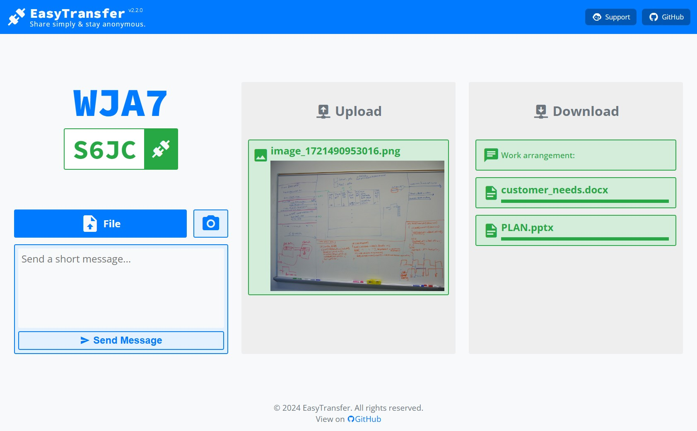

# EasyTransfer

[English](README.md) | 简体中文

👉**立即体验：[EasyTransfer](https://file.ch3nyang.top/)**

EasyTransfer 是一款免费、匿名、加密（*TODO*）且易于使用的 E2EE 文件传输工具。您只需访问一个简单的网页，即可使用设备代码连接到**任何网络**中的**任何设备**。

它使用 webRTC 和 Vue.js 构建，并且

- **无需**安装任何软件
- **无需**注册账户
- **无需**扫描二维码
- **无需**分享 URL 链接
- **无需**上传文件到服务器[^1]
- **无需**担心网络环境

## 使用方法

1. 在需要传输文件的两台设备上访问 [EasyTransfer](https://file.ch3nyang.top/)。
2. 将任意一台设备的四位设备代码输入到另一台设备的设备代码输入框中，并点击连接按钮。
3. 等待连接成功后，您可以将文件拖放到网页上的文件区域，或者点击文件区域选择文件。支持一次性发送多个文件。

## 注意事项

- 加密传输正在开发中，当前信令及数据可能存在泄漏风险，请勿传输隐私文件。
- 本项目全部托管在免费的服务器上，请不要滥用。

## 自行部署

1. [fork](https://github.com/WCY-dt/EasyTransfer/fork) 本项目。
2. 将整个项目导入到 [glitch](https://glitch.com/) 中或您自己的服务器中。
3. 修改 [`./client/e2e/connectCore.js`](https://github.com/WCY-dt/EasyTransfer/blob/main/client/e2e/connectCore.js) 中的 `signalServerUrl` 和 `iceServers` 为您自己的地址。
4. 开启 GitHub Pages，并选择 `gh-pages` 分支作为源。

## TODO

- [x] 支持大文件传输
- [x] 优化传输速度
- [x] 支持拍照传输
- [x] 支持纯文本传输
- [ ] 支持断点续传
- [ ] 支持加密传输
- [ ] 支持多设备

## 致谢

- 感谢 [metered](https://www.metered.ca/) 提供免费的 STUN 和 TURN 服务器。
- 感谢 [glitch](https://glitch.com/) 提供了免费的信令服务器。

[^1]: 在通信双方需要内网穿透时，文件可能会上传到本项目提供的免费 TURN 服务器。您可以自行部署一个可信的 TURN 服务器来避免这种情况。
