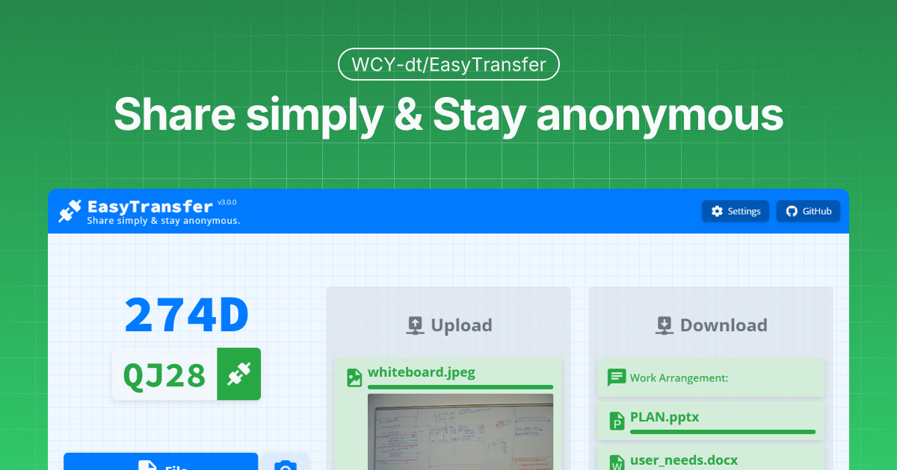

<h1>EasyTransfer</h1>

[简体中文](README_ZH-cn.md) | English

   

<strong style="font-size: 24px;">👉 EXPERIENCE NOW: <a href="https://file.ch3nyang.top/">EasyTransfer</a></strong>

EasyTransfer is a free, anonymous, encrypted, and easy-to-use E2EE file transfer tool. You only need to visit a simple web page to connect to **any device** in **any network** using a device code.

It is built using webRTC and Vue.js.

## How to use

1. Visit [EasyTransfer](https://file.ch3nyang.top/) on the two devices where you need to transfer files.
2. Enter the four-digit device code of any device into the device code input box of the other device and click the connect button.
3. After waiting for the connection to succeed, you can drag and drop the file to the file area on the web page, or click the file area to select the file. Supports sending multiple files at once.
4. In the settings, you can customize the STUN server and TURN server, or specify the maximum number of connections.

> [!NOTE]
>
> It is recommended that you deploy a STUN/TURN server yourself to obtain faster speed and higher stability.

## Features

What makes EasyTransfer different? It's these features:

- 🫣 **Anonymous**: No need to register an account, log in, or provide any personal information
- 🔒 **Encrypted**: Default encryption ensures the security of file transfer
- 🔄 **End-to-end**: Files are transferred directly from the sender to the receiver without going through the server[^1]
- 🌐 **Cross-network**: Supports file transfer between LAN and WAN
- 🛠️ **Easy to use**: Connect devices using a four-digit device code, without any extra operations
- 📎 **Multimedia messages**: Supports sending text and various file types, and also supports sending photos
- ⚙️ **Custom settings**: All modules can be customized and deployed by yourself

## Self-deployment

This project supports multiple deployment methods, including direct deployment to the free Glitch server or using Docker to deploy to a local server.

For specific deployment methods, please refer to the [Project Wiki](https://github.com/WCY-dt/EasyTransfer/wiki/Navigator).

## Contributing

If you want to contribute code to this project, please refer to the [Contribution Guide](https://github.com/WCY-dt/EasyTransfer/blob/main/CONTRIBUTING.md).

## Changelog

Please refer to the [CHANGELOG](https://github.com/WCY-dt/EasyTransfer/blob/main/CHANGELOG.md).

[^1]: If the communicating peers need to penetrate the intranet, the file may be uploaded to the free TURN server provided by this project. You can avoid this by deploying a trusted TURN server yourself.
