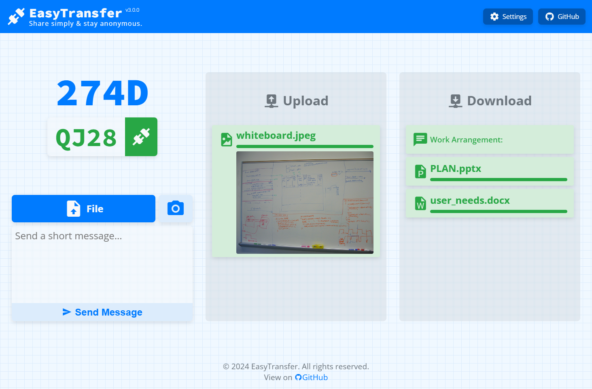

# EasyTransfer - Share simply & stay anonymous

 

[English](README.md) | 简体中文

**👉 立即体验：[EasyTransfer](https://file.ch3nyang.top/)**



EasyTransfer 是一款免费、匿名、加密且易于使用的 E2EE 文件传输工具。您只需访问一个简单的网页，即可使用设备代码连接到**任何网络**中的**任何设备**。

它使用 webRTC 和 Vue.js 构建，并且

- **无需**安装任何软件
- **无需**注册账户
- **无需**扫描二维码
- **无需**分享 URL 链接
- **无需**上传文件到服务器[^1]
- **无需**担心网络环境

## 使用方法

1. 在需要传输文件的两台设备上访问 [EasyTransfer](https://file.ch3nyang.top/)。
2. 将任意一台设备的四位设备代码输入到另一台设备的设备代码输入框中，并点击连接按钮。
3. 等待连接成功后，您可以将文件拖放到网页上的文件区域，或者点击文件区域选择文件。支持一次性发送多个文件。
4. 在设置中，可以自定义 STUN 服务器和 TURN 服务器，或者指定最大连接数。

## 注意事项

- 本项目全部托管在免费的服务器上，请不要滥用。

## 自行部署

1. [fork](https://github.com/WCY-dt/EasyTransfer/fork) 本项目。

2. 点击下方按钮，将整个项目导入到 [glitch](https://glitch.com/) 中。

   [](https://glitch.com/edit/#!/import/github/WCY-dt/EasyTransfer)

   > 您也可以选择使用本项目提供的自动化部署脚本。您只需要在 Glitch 中创建一个新的项目，并在项目的控制台中运行以下命令：
   >
   > ```shell
   > git config receive.denyCurrentBranch ignore
   > ```
   >
   > 然后在 GitHub 中设置 Secrets，将 `GLITCH_GIT_URL` 设置为您的 Glitch 项目的 Git URL。
   >
   > 每当您 push 代码到 `main` 分支时，GitHub Actions 将自动将代码同步到 Glitch 项目中。

3. 您可能需要对代码做出的修改包括：

   - **IceServers**：在 [`./client/src/stores/connect.js`](./client/src/stores/setting.ts) 中修改 `iceServers` 为您自己的 STUN 和 TURN 服务器地址；
   - **SignalServerUrl**：在 [`./client/.env.production`](./client/.env.production) 中修改 `VITE_SIGNAL_SERVER_URL` 为您自己的信令服务器地址；
   - 你可能还需要修改 [`./client/.env.development`](./client/.env.development) 中的 `VITE_SIGNAL_SERVER_URL`，以便在开发环境中使用不同的信令服务器地址，以避免与生产环境冲突。

4. 开启 GitHub Pages，并选择 `gh-pages` 分支作为源。GitHub Actions 将自动构建并部署。

## TODO

- [x] 支持大文件传输
- [x] 优化传输速度
- [x] 支持拍照传输
- [x] 支持纯文本传输
- [x] 支持并行传输

## 致谢

- 感谢 [metered](https://www.metered.ca/) 提供免费的 STUN 和 TURN 服务器。
- 感谢 [glitch](https://glitch.com/) 提供了免费的信令服务器。

[^1]: 在通信双方需要内网穿透时，文件可能会上传到本项目提供的免费 TURN 服务器。您可以自行部署一个可信的 TURN 服务器来避免这种情况。

## 统计

> 感谢[阮一峰老师](http://www.ruanyifeng.com/blog/2024/12/weekly-issue-329.html)的推荐！

[](https://starchart.cc/WCY-dt/EasyTransfer)
